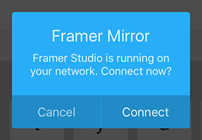
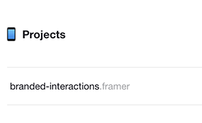

# Branded Interactions
An internal prototyping tool that allows clients to build out visual cues for how their brand might play out as a series of screen-based interactions.

##### Why?
To facilitate the building out the mood and tone of their brand on screen-based interactions, alongside other branding considerations.

##### How?
Clients will be able to directly manipulate (using either physical - knobs, faders etc or digital controls - on screen spectrum tools) shapes, speeds, pace, lights of simple objects (and potentially save them out as gifs or videos but maybe not MVP).

***

### Current state
The current version of the tool as been built in prototype form to *quickly* validate ideas [proposed by Joe Smith](https://docs.google.com/a/ustwo.com/document/d/19qUv0BSxZoihyoiLQi-Y1dvAGcc5_rFYiQIodabg58A/edit?usp=sharing) over the New York 2015 summer. As a result, the tool is currently "dumb"—and the interactions defined within the tool must be manually logged or recorded for future use.

##### Format
The prototype has been designed for fullscreen, landscape iPad use, but built (mostly) responsively to allow for more devices/variations down the line.

##### How to use
You'll need an iPad and a Mac with [Framer Studio](http://framerjs.com), both running on the same local network.

1. Clone or download this project  
2. Drag the whole `branded-interactions.framer` folder onto the [Framer Studio](http://framerjs.com) app icon  
3. Download and open the [Frameless iPad app](https://itunes.apple.com/us/app/frameless-full-screen-web/id933580264?mt=8)  
4. Make sure both the iPad and your Mac are running on the same network. Hit "Connect" to see the `branded-interactions.framer` prototype
5. You should see a list of  Framer projects open on the network. Tap `branded-interactions.framer`

 

Also works with iOS Safari (with browser chrome, though).

##### How to preview
You can preview by doing the same steps as above, except viewing in a WebKit browser on your Mac. You can use [Framer Generator](https://github.com/koenbok/Framer) instead of Framer Studio.

***

### Future plans
We'd like to facilitate workshops with clients that allow them explore and solidify directions to build upon in projects. These exercises will probably need to be prefaced with branded interactions in context, to help their understanding of the importance of such an exercise in the first place.

##### Next steps
- Internal interviews with experienced workshop-facilitators. Some of these people include Jason, Yu Jin, Paul G
- Experiment with physical interactions (LittleBits, etc)

***

### To-do
- [x] Isolated live-updating elements (position, rotation, etc)
- [x] Presets
- [x] Live-updating sliders for spring values
- [ ] Label sliders
- [ ] Context for slider changes (a visual point at the original setting for each)
- [x] Update presets with useful values
- [ ] Update and add in-device examples (menus etc)
- [x] Better custom settings
- [ ] Save, edit, export functionality on custom settings
- [x] Module-out as much as possible
- [x] Condense rest of code (functions, arrays, all that good stuff)
- [ ] Limit or replace horizontal scroll with left/right buttons (on right side)
- [ ] Visualise (and live-update) spring/ease/linear graph (like the [Framer Learn](http://framerjs.com/learn/basics/animation/) examples, or [Simon's link](http://hosted.zeh.com.br/mctween/animationtypes.html))
- [ ] Remove or modify 'reset' button on custom page/screen
- [ ] Fix `savedScroll` bottom margin quirk
